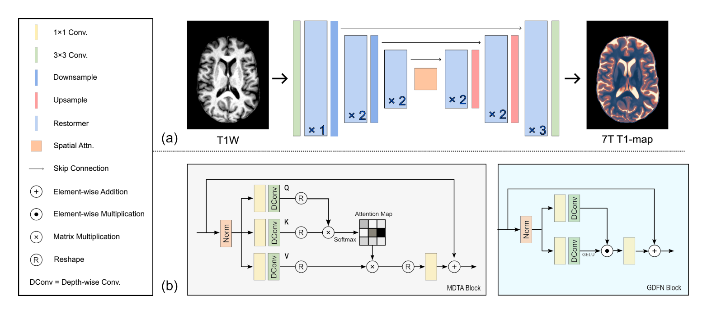
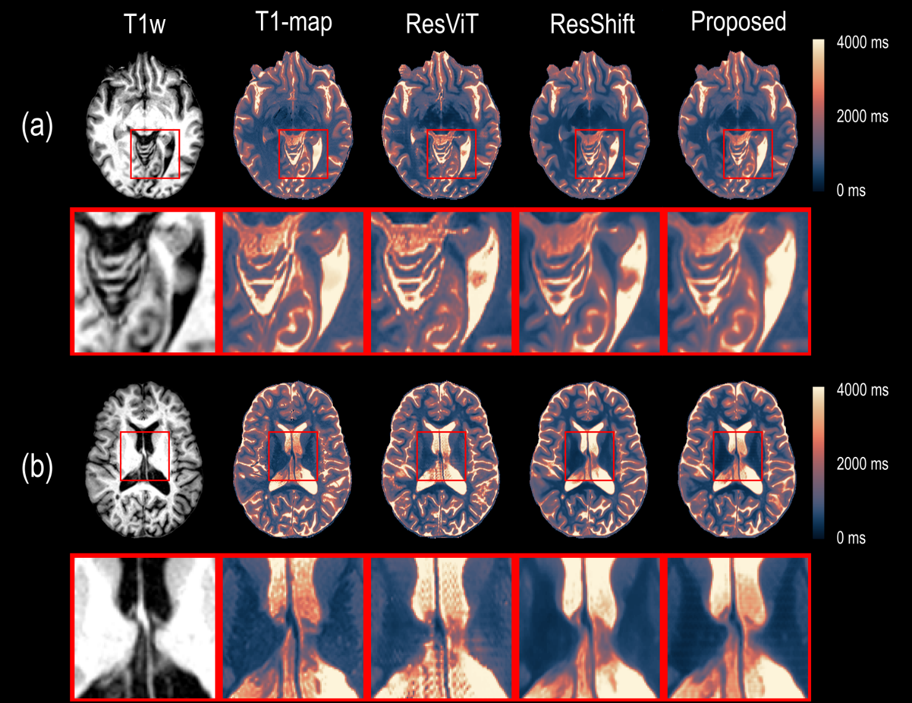

# 7T T1-Map Synthesis from 1.5T and 3T T1w MRI

Code for synthesizing 7T T1 maps from routine 1.5T and 3T T1-weighted MRI, including the proposed **7T-Restormer** model and comparison implementations for **ResViT** and **ResShift**.

Project paper:

- [Generalizable 7T T1-map Synthesis from 1.5T and 3T T1 MRI with an Efficient Transformer Model](https://arxiv.org/abs/2507.08655)

## Overview

Ultra-high-field 7T MRI can provide improved tissue contrast and resolution, but access to 7T scanners is limited. This repository collects the models used to predict 7T-quality T1 maps from lower-field clinical MRI.

The exported codebase currently contains:

- [7T-Restormer](./7T-Restormer): the proposed transformer-based method.
- [ResViT](./ResViT): a residual vision transformer baseline adapted to this dataset.
- [ResShift-diffusion](./ResShift-diffusion): a residual-shifting diffusion baseline adapted to this dataset.



*Figure 1. Overview of the proposed 7T-Restormer architecture.*

This repository intentionally excludes:

- raw MRI/NIfTI data
- derived PNG datasets
- trained checkpoints
- evaluation notebooks and analysis scripts
- generated figures and experiment outputs

## Methods

### 7T-Restormer

This is the main method introduced in the project paper above. The implementation in [7T-Restormer](./7T-Restormer) is built around a Restormer-style image restoration backbone adapted for 2D slice-wise T1w to T1-map translation.

Related backbone paper:

- [Restormer: Efficient Transformer for High-Resolution Image Restoration](https://arxiv.org/abs/2111.09881)

Included entrypoints:

- [7T-Restormer/main.py](./7T-Restormer/main.py): primary non-LPIPS training/testing script using an explicit split CSV.
- [7T-Restormer/main_with_lpips.py](./7T-Restormer/main_with_lpips.py): LPIPS/perceptual-loss variant using an explicit split CSV.
- [7T-Restormer/model_single.py](./7T-Restormer/model_single.py): model definition.



*Figure 3. Representative qualitative examples comparing synthesized 7T T1 maps with acquired ground truth.*

### ResViT

This folder contains the ResViT comparison model used for the same 1.5T/3T to 7T T1-map task.

Paper:

- [ResViT: Residual Vision Transformers for Multi-Modal Medical Image Synthesis](https://arxiv.org/abs/2106.16031)

Included entrypoints:

- [ResViT/train.py](./ResViT/train.py): training script.
- [ResViT/test.py](./ResViT/test.py): test-time inference and slice-wise metric export.

### ResShift

This folder contains the diffusion-based ResShift comparison model adapted to the same PNG dataset layout.

Paper:

- [ResShift: Efficient Diffusion Model for Image Super-resolution by Residual Shifting](https://arxiv.org/abs/2307.12348)

Included entrypoints:

- [ResShift-diffusion/main.py](./ResShift-diffusion/main.py): training/testing entrypoint.
- [ResShift-diffusion/build.py](./ResShift-diffusion/build.py): model/training wrapper.
- [ResShift-diffusion/datasets](./ResShift-diffusion/datasets): dataset loaders.
- [ResShift-diffusion/diffusion](./ResShift-diffusion/diffusion): diffusion process code.
- [ResShift-diffusion/networks](./ResShift-diffusion/networks): network components.

## Repository Layout

```text
7T-Restormer/
ResViT/
ResShift-diffusion/
requirements.txt
```

## Installation

Create a Python environment and install dependencies:

```bash
python -m venv .venv
source .venv/bin/activate
pip install -r requirements.txt
```

The code assumes a PyTorch-based environment with GPU support for practical training/inference.

## Dataset Layout

All three methods expect paired slice PNGs arranged by patient and modality. By default, the code assumes the dataset is available under `./data`.

Expected directory structure:

```text
data/
  15T_to_7T/
    <patient_id>/
      reg_t1w_brain/
        slice_000.png
        slice_001.png
        ...
      t1map_brain/
        slice_000.png
        slice_001.png
        ...
  3T_to_7T/
    <patient_id>/
      reg_t1w_brain/
        slice_000.png
        slice_001.png
        ...
      t1map_brain/
        slice_000.png
        slice_001.png
        ...
```

Conventions:

- `reg_t1w_brain` is the model input directory.
- `t1map_brain` is the ground-truth target directory.
- Slice filenames must match between the two directories for a given patient.
- Filenames are expected to follow the `slice_###.png` convention.
- `patient_id` is treated as a string, not an integer.

Run commands from the repository root so these relative paths resolve correctly.

## Split CSV Files

All three methods use the same patient-level split CSV:

- [split.csv](./split.csv)

Expected CSV format:

```csv
patient_id,split
10854038,train
12272356,val
12293355,test
```

Rules:

- The file must contain exactly the columns `patient_id` and `split`.
- Valid `split` values are `train`, `val`, and `test`.
- Splits are patient-level, not slice-level.
- `patient_id` values should match the patient folder names under `data/15T_to_7T` and `data/3T_to_7T`.

Method-specific behavior:

- `7T-Restormer/main.py` and `7T-Restormer/main_with_lpips.py` use an explicit `--split_csv` argument and default to `./split.csv`.
- `ResViT/train.py`, `ResShift-diffusion/main.py`, and `ResViT/test.py` default to `./split.csv`.

## How to Run

### 7T-Restormer

Primary non-LPIPS runner:

```bash
python 7T-Restormer/main.py \
  --mode train \
  --dir15 ./data/15T_to_7T \
  --dir3 ./data/3T_to_7T \
  --split_csv ./split.csv \
  --out_dir ./outputs/7t-restormer
```

Test with a checkpoint:

```bash
python 7T-Restormer/main.py \
  --mode test \
  --dir15 ./data/15T_to_7T \
  --dir3 ./data/3T_to_7T \
  --split_csv ./split.csv \
  --ckpt ./outputs/7t-restormer/best.pth \
  --out_dir ./outputs/7t-restormer
```

LPIPS/perceptual-loss variant:

```bash
python 7T-Restormer/main_with_lpips.py \
  --mode train \
  --dir15 ./data/15T_to_7T \
  --dir3 ./data/3T_to_7T \
  --split_csv ./split.csv \
  --out_dir ./outputs/7t-restormer-lpips
```

Notes:

- `main.py` uses `nn.L1Loss`.
- `main_with_lpips.py` combines L1 loss with `monai.losses.PerceptualLoss`.

### ResViT

Training:

```bash
python ResViT/train.py
```

Testing:

```bash
python ResViT/test.py
```

What these scripts expect:

- dataset under `./data/15T_to_7T` and `./data/3T_to_7T`
- patient-level split file at `./split.csv`
- outputs written under `./outputs/resshift`

### ResShift-diffusion

Training:

```bash
python ResShift-diffusion/main.py \
  --train true \
  --dir_15T ./data/15T_to_7T \
  --dir_3T ./data/3T_to_7T \
  --split_csv ./split.csv \
  --out_dir ./outputs/resshift-diffusion/train
```

Testing:

```bash
python ResShift-diffusion/main.py \
  --train false \
  --dir_15T ./data/15T_to_7T \
  --dir_3T ./data/3T_to_7T \
  --split_csv ./split.csv \
  --out_dir_test ./outputs/resshift-diffusion/test
```

What this script expects:

- dataset under `./data/15T_to_7T` and `./data/3T_to_7T`
- patient-level split file at `./split.csv`
- PNG slices with matched filenames across input and target folders
- outputs written under `./outputs/resshift-diffusion`

## Outputs

Depending on the method and mode, scripts may write:

- model checkpoints such as `best.pth` or `best_model.pth`
- training metric CSV files
- test metric CSV files
- validation example PNGs
- per-slice metric summaries

By default, the cleaned export uses repo-relative output locations under `./outputs`.

## Important Notes

- This repository is a cleaned, shareable packaging of the project code, not a full refactor.
- The three methods are not yet normalized to one common CLI/API.
- Running from the repository root is strongly recommended because several scripts rely on relative paths.

## Citation

If you use this repository, please cite:

- [Generalizable 7T T1-map Synthesis from 1.5T and 3T T1 MRI with an Efficient Transformer Model](https://arxiv.org/abs/2507.08655)
